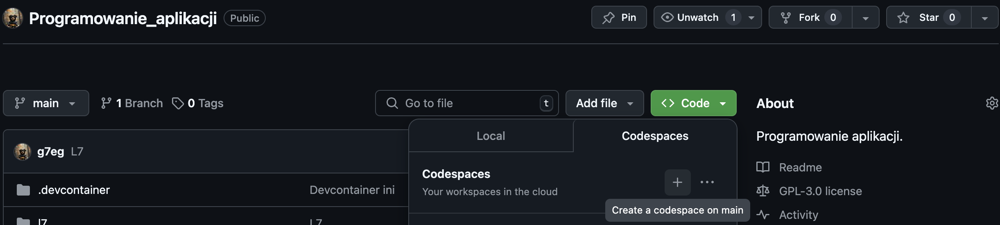

# Podstawy programowania
Podstawy programowania.

___

Jak zalogować się do Codespace:

Jak zalogować się do Codespace: 
1) :mailbox: Załóż konto na GitHub korzystając z maila studenckiego. 
2) :key: Zaloguj się na swoje konto GitHub. 
3) :link: Odnajdź niniejsze repozytorium: [Podstawy programowania](https://github.com/g7eg/Podstawy_programowania) 

1) :running: Uruchomm Codespace klikając następujące przyciski jak pokazano na screenie poniżej:
> 1) Code
> 2) Codespaces
> 3) Wybierz z listy utworzene Codespace a jeżeli uruchamiasz je po raz pierwszy to wybierz '+' (Create a codespace on main)

 

> [!NOTE]
> Codespace pozwala pracować w prekonfigurowanym środowisku z poziomu przeglądarki internetowej. Nie musisz instalować żadnego środowiska lokalnie na komputerze. Wystarczy że zalogujesz się na swoje konto.

### LISTY ZADAŃ:

> [!NOTE]
> :book: Treść zadań dla poszczególnych list znajduje się w rozwijanym menu poniżej. Polecenie możesz też znaleźć w plikach .py znajdujących się w Codespace. Jeżeli treść polecenia poniżej różni się od tej w pliku, przyjmij że treść polecenia w pliku jest tą właściwą. Fakt ten zgłość również prowadzacemu :gem:

 Treść zadań lista 7 

# Lista 7 :guitar:

## Lista 7 Zad. 1
Napisać program proszący użytkownika o imię i rok urodzenia, a następnie obliczający i wypisujący jego
wiek.
> [!TIP]
> Przykład:
Podaj swoje imię:
Siemomysł
Podaj rok urodzenia:
1989
Siemomysł, masz 33 lata.

___
## Lista 7 Zad. 2 
Napisać program proszący użytkownika o podanie dwóch liczb a i b i wypisujący ich sumę, różnicę,
iloczyn, iloraz, √(𝑎 + 𝑏) oraz ab i ba. W przypadku dzielenia przez 0 lub a+b < 0 zwróć wynik jak0 'undefined'.
> [!TIP]
> Przykład:
Podaj liczbę a: 5
Podaj liczbę b: 0
Suma: 5.0
Różnica: 5.0
Iloczyn: 0.0
Iloraz: undefined
Pierwiastek z (a + b): 2.23606797749979
a do potęgi b: 1.0
b do potęgi a: 0.0
___
## Lista 7 Zad. 3
Napisać program, który oblicza pole i obwód koła o promieniu podanym przez użytkownika. Promień
nie może być ujemny. W przypadku podania liczby ujemnej, program powinien wypisywać komunikat "Błąd: Promień nie może być ujemny." informujący o błędnej wartości i nic nie liczyć.
> [!TIP]
> Przykład:
Podaj promień koła: 12
Pole koła: 452.3893421169302
Obwód koła: 75.39822368615503

> [!TIP]
> Przykład:
Podaj promień koła: -12
Błąd: Promień nie może być ujemny.
___

## Lista 7 Zad. 4
Napisać program proszący użytkownika o podanie dwóch liczb a i b. Następnie należy wyświetlić, która
z tych liczb jest większa, bądź komunikat, że są sobie równe.
> [!TIP]
> Przykład:
Podaj pierwszą liczbę (a): 2
Podaj drugą liczbę (b): 2
Liczby są sobie równe.

> [!TIP]
> Przykład:
Podaj pierwszą liczbę (a): -2
Podaj drugą liczbę (b): 2
Liczba 2.0 jest większa od -2.0.

___
## Lista 7 Zad. 5
Napisać program sprawdzający czy osoba urodzona w danym roku jest pełnoletnia
> [!TIP]
> Przykład:
Podaj swoje imię: Marian
Podaj rok urodzenia: 1833
Marian, masz 191 lat, jesteś pełnoletni.
___

## Lista 7 Zad. 6
Napisać program, który sprawdzi czy podana liczba jest parzysta i wyświetli odpowiedni komunikat.
> [!TIP]
> Przykład:
Podaj liczbę: 34
Liczba 34 jest parzysta.

> [!TIP]
> Przykład:
Podaj liczbę: -123
Liczba -123 jest nieparzysta.
___
## Lista 7 Zad. 7
Napisać program, który sprawdzi czy z podanych długości można stworzyć trójkąt i wypisze odpowiedni
komunikat.
> [!TIP]
> Przykład:
Podaj długość pierwszego boku: 1
Podaj długość drugiego boku: 2
Podaj długość trzeciego boku: 3
Nie można stworzyć trójkąta.

> [!TIP]
> Przykład:
Podaj długość pierwszego boku: 3
Podaj długość drugiego boku: 4
Podaj długość trzeciego boku: 5
Można stworzyć trójkąt.
___

## Lista 7 Zad. 8
Napisać program, który pobierze od studenta liczbę punktów i oceni go według podanej skali. Ponadto
użytkownik może wybrać w jakiej formie chce dostać ocenę (liczbowo lub słownie lub oba). W przypadku podania błędnej formy wypisz kompunikat: 'Nieznana forma oceny.'
Skala:
<0; 50) 2.0 (niedostateczny)
<50;60) 3.0 (dostateczny)
<60;70) 3.5 (dostateczny plus)
<70;80) 4.0 (dobry)
<80;90) 4.5 (dobry plus)
<90;100) 5.0 (bardzo dobry)
<100> 5.5 (celujący)
> [!TIP]
> Przykład:
Podaj liczbę punktów: 66
Wybierz formę oceny (liczbowo, słownie, oba): liczbowo
Otrzymałeś ocenę: 3.5

> [!TIP]
> Przykład:
Podaj liczbę punktów: 99
Wybierz formę oceny (liczbowo, słownie, oba): oba
Otrzymałeś ocenę: 5.0 (bardzo dobry)

 Treść zadań lista 8 

# Lista 8 :crown:
___

## Lista 8 Zad. 1
Napisać program, który dla wprowadzonego przez użytkownika ciągu liczb rzeczywistych wyznacza ich
średnią arytmetyczną. Wprowadzanie ciągu kończy się poprzez wprowadzenie napisu ’end’. Program
powinien raportować błąd, jeśli ’end’ jest pierwszą podaną wartością.

> [!TIP]
> Przykład:
Podaj liczbę (lub 'end' aby zakończyć): 1
Podaj liczbę (lub 'end' aby zakończyć): -22
Podaj liczbę (lub 'end' aby zakończyć): 8
Podaj liczbę (lub 'end' aby zakończyć): -3.5
Podaj liczbę (lub 'end' aby zakończyć): 13
Podaj liczbę (lub 'end' aby zakończyć): end
Średnia arytmetyczna wynosi: -0.7

___

## Lista 8 Zad. 2
Napisać program wyświetlający liczby całkowite z przedziału <0,y> (liczbę całkowitą y podaje użytkownik). W przypadku podania niewłaściwej wartości wyświetl komunikat: "Błąd: Liczba y musi być większa lub równa 0."
> [!TIP]
> Przykład:
Podaj liczbę całkowitą y: 2
0
1
2

> [!TIP]
> Przykład:
Podaj liczbę całkowitą y: -2
Błąd: Liczba y musi być większa lub równa 0.
___
## Lista 8 Zad.3 
Napisać program wyświetlający liczby całkowite z przedziału <x,y> (liczby całkowite x i y podajeużytkownik). W przypadku podania niewłaściwej wartości wyświetl komunikat: "Błąd: Liczba x musi być mniejsza lub równa liczbie y."
> [!TIP]
> Przykład:
Podaj liczbę całkowitą x: -2
Podaj liczbę całkowitą y: 5
-2
-1
0
1
2
3
4
5

> [!TIP]
> Przykład:
Podaj liczbę całkowitą x: 4
Podaj liczbę całkowitą y: 2
Błąd: Liczba x musi być mniejsza lub równa liczbie y.
___
## Lista 8 Zad. 4
Napisać program, który wyświetli wszystkie liczby z przedziału od 50 do 100 podzielne przez dowolną liczbę k, którą podaje użytkownik. W przypadku podania niewłaściwej wartości wyświetl komunikat: "Błąd: Liczba k musi być większa od zera."
> [!TIP]
> Przykład:
Podaj liczbę całkowitą k: 4
52
56
60
64
68
72
76
80
84
88
92
96
100

> [!TIP]
> Przykład:
Podaj liczbę całkowitą k: -2
Błąd: Liczba k musi być większa od zera.
___
## Lista 8 Zad. 5
Napisać program, gdzie zadaniem gracza jest odgadnięcie liczby. Liczba jest wprowadzona na stałe w kodzie. Jeżeli użytkownik poda za dużą liczbę program wyświetli komunikat „Szukana wartość jest mniejsza”. Jeżeli wprowadzi za małą liczbę program wyświetli „Szukana wartość jest większa”. Po odgadnięciu liczby gracz dowiaduje się po ilu próbach udało mu się zakończyć grę.
> [!TIP]
> Przykład:
Podaj liczbę: 22
Szukana wartość jest większa
Podaj liczbę: 45
Szukana wartość jest mniejsza
Podaj liczbę: 42
Brawo! Odgadłeś liczbę w 3 próbach.

> [!TIP]
> Przykład:
Podaj liczbę: 42
Brawo! Odgadłeś liczbę w 1 próbach.
___
## Lista 8 Zad. 6
Napisać program, który narysuje z gwiazdek (*) kwadrat 10 na 10.
> [!TIP]
> Przykład:
<blockquote>
********** 
********** 
********** 
********** 
********** 
********** 
********** 
********** 
********** 
********** 
</blockquote>

___
## Lista 8 Zad. 7
Napisać program który wypisze na ekranie wszystkie możliwe kombinacje książek jakie można wybrać.
Do wyboru jest pięć książek, a wybieramy trzy z nich. 
> [!TIP]
> Przykład:
1 2 3
1 2 4
1 2 5
1 3 4
1 3 5
1 4 5
2 3 4
2 3 5
2 4 5
3 4 5

 Treść zadań lista 9 

# Lista 9 :ghost:
___
## Lista 9 Zad. 1
Napisać program proszący użytkownika o ilość liczb, które chce wprowadzić, następnie po kolei, każdą
liczbę należy wprowadzić do listy i wypisać cała zawartość listy. W przypadku podania niepoprawnej
wartości w pierwszym pytaniu program powinien powiadomić użytkownika o błędzie.

> [!TIP]
> Przykład:
Ile chcesz wprowadzić liczb? 3
Podaj liczbę: 12
Podaj liczbę: 33
Podaj liczbę: 2
Lista: [12, 33, 2]

___
## Lista 9 Zad. 2
Korzystając z programu z zad 1 do wprowadzenia liczb, zsumować wszystkie liczby w liście i wypisać na ekran.

> [!TIP]
> Przykład:
Ile chcesz wprowadzić liczb? 3
Podaj liczbę: 2
Podaj liczbę: 3
Podaj liczbę: 5
Lista: [2, 3, 5]
Suma liczb: 10

___
## Lista 9 Zad. 3
Korzystając z programu z zad 1 do wprowadzenia liczb, znaleźć najmniejszą i największą wartość w
liście i wypisać ją na ekran

> [!TIP]
> Przykład:
Ile chcesz wprowadzić liczb? 4
Podaj liczbę: 2
Podaj liczbę: 3
Podaj liczbę: 5
Podaj liczbę: 6
Lista: [2, 3, 5, 6]
Najmniejsza wartość: 2
Największa wartość: 6

> [!TIP]
> Przykład:
Ile chcesz wprowadzić liczb? -2
Błędna wartość, wprowadź liczbę większą niż 0.

___
## Lista 9 Zad. 4
Korzystając z programu z zad 1 do wprowadzenia liczb, znaleźć wszystkie pary liczb, których w suma
daje liczbę podaną przez użytkownika.

> [!TIP]
> Przykład:
Ile chcesz wprowadzić liczb? 5
Podaj liczbę: 3
Podaj liczbę: 4
Podaj liczbę: 0
Podaj liczbę: 7
Podaj liczbę: 1
Lista: [3, 4, 0, 7, 1]
Wprowadź szukaną sumę: 7
3 + 4 = 7
0 + 7 = 7

> [!TIP]
> Przykład:
Ile chcesz wprowadzić liczb? 2
Podaj liczbę: 2
Podaj liczbę: 3
Lista: [2, 3]
Wprowadź szukaną sumę: 22
Brak par liczb, których suma jest równa szukanej sumie.

___
## Lista 9 Zad. 5
Przygotować słownik zawierający min 5 kierunków studiów oferowanych na Politechnice Wrocławskiej
razem z wydziałem, na którym są oferowane. Następnie napisać program, który będzie wskazywał na
jakim wydziale znajduje się kierunek wyszukiwany przez użytkownika. W przypadku braku takiego
kierunku poinformuj użytkownika, że nie może studiować tego kierunku na Politechnice Wrocławskiej.

> [!TIP]
> Przykład:
Podaj nazwę kierunku studiów: Informatyka
Kierunek Informatyka znajduje się na Wydział Elektroniki.

> [!TIP]
> Przykład:
Podaj nazwę kierunku studiów: Garncarstwo
Nie możesz studiować kierunku Garncarstwo na Politechnice Wrocławskiej.

___
## Lista 9 Zad. 6
Napisać program, który pobierze od użytkownika zdanie, a następnie policzy występowania
poszczególnych znaków w danym zdaniu (oprócz znaku spacji), umieści wynik w słowniku i wypisze go
na ekran. Zastosować metodę .lower(), aby do słownika wprowadzać tylko małe litery niezależnie od
tego jak zostały wprowadzone przez użytkownika. Litery mają być kluczem, wartością liczba wystąpień.

> [!TIP]
> Przykład:
Podaj zdanie: Python jest SUPER!
{'p': 2, 'y': 1, 't': 2, 'h': 1, 'o': 1, 'n': 1, 'j': 1, 'e': 2, 's': 2, 'u': 1, 'r': 1, '!': 1}

