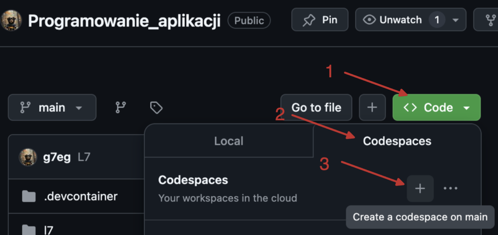

# Programowanie_aplikacji
Programowanie aplikacji.

___
Jak zalogować się do Codespace:
1) :mailbox: Załóż konto na GitHub korzystając z maila studenckiego.
2) :key: Zaloguj się na swoje konto GitHub.
3) :link: Odnajdź niniejsze repozytorium  
[Podstawy programowania](https://github.com/g7eg/Podstawy_programowania)

4) :running: Uruchomm Codespace klikając następujące przyciski:
> 1) Code
> 2) Codespaces
> 3) Wybierz z listy utworzene Codespace a jeżeli uruchamiasz je po raz pierwszy to wybierz '+' (Create a codespace on main)

> [!NOTE]
> Codespace pozwala pracować w prekonfigurowanym środowisku z poziomu przeglądarki internetowej. Nie musisz instalować żadnego środowiska lokalnie na komputerze. Wystarczy że zalogujesz się na swoje konto.

 Treść zadań lista 7 :guitar: 

# Lista 7
___
Lista 7 Zad. 1
Napisać program proszący użytkownika o imię i rok urodzenia, a następnie obliczający i wypisujący jego
wiek.
Przykładowe wykonanie:
Podaj swoje imię:
Siemomysł
Podaj rok urodzenia:
1989
Siemomysł, masz 33 lata.

___
Lista 7 Zad. 2 Napisać program proszący użytkownika o podanie dwóch liczb a i b i wypisujący ich sumę, różnicę,
iloczyn, iloraz, √(𝑎 + 𝑏) oraz ab i ba. W przypadku dzielenia przez 0 lub a+b < 0 zwróć wynik jak0 'undefined'.
Przykład:
Podaj liczbę a: 5
Podaj liczbę b: 0
Suma: 5.0
Różnica: 5.0
Iloczyn: 0.0
Iloraz: undefined
Pierwiastek z (a + b): 2.23606797749979
a do potęgi b: 1.0
b do potęgi a: 0.0
___
Lista 7 Zad. 3
Napisać program, który oblicza pole i obwód koła o promieniu podanym przez użytkownika. Promień
nie może być ujemny. W przypadku podania liczby ujemnej, program powinien wypisywać komunikat "Błąd: Promień nie może być ujemny." informujący o błędnej wartości i nic nie liczyć.
Przykład:
Podaj promień koła: 12
Pole koła: 452.3893421169302
Obwód koła: 75.39822368615503
Przykład:
Podaj promień koła: -12
Błąd: Promień nie może być ujemny.
___

Lista 7 Zad. 4
Napisać program proszący użytkownika o podanie dwóch liczb a i b. Następnie należy wyświetlić, która
z tych liczb jest większa, bądź komunikat, że są sobie równe.
Przykład:
Podaj pierwszą liczbę (a): 2
Podaj drugą liczbę (b): 2
Liczby są sobie równe.
Przykład:
Podaj pierwszą liczbę (a): -2
Podaj drugą liczbę (b): 2
Liczba 2.0 jest większa od -2.0.

___
Lista 7 Zad. 5
Napisać program sprawdzający czy osoba urodzona w danym roku jest pełnoletnia
Przykład:
Podaj swoje imię: Marian
Podaj rok urodzenia: 1833
Marian, masz 191 lat, jesteś pełnoletni.
___

Lista 7 Zad. 6
Napisać program, który sprawdzi czy podana liczba jest parzysta i wyświetli odpowiedni komunikat.
Przykład:
Podaj liczbę: 34
Liczba 34 jest parzysta.
Przykład:
Podaj liczbę: -123
Liczba -123 jest nieparzysta.
___
Lista 7 Zad. 7
Napisać program, który sprawdzi czy z podanych długości można stworzyć trójkąt i wypisze odpowiedni
komunikat.
Przykład:
Podaj długość pierwszego boku: 1
Podaj długość drugiego boku: 2
Podaj długość trzeciego boku: 3
Nie można stworzyć trójkąta.
Przykład:
Podaj długość pierwszego boku: 3
Podaj długość drugiego boku: 4
Podaj długość trzeciego boku: 5
Można stworzyć trójkąt.
___

Lista 7 Zad. 8
Napisać program, który pobierze od studenta liczbę punktów i oceni go według podanej skali. Ponadto
użytkownik może wybrać w jakiej formie chce dostać ocenę (liczbowo lub słownie lub oba). W przypadku podania błędnej formy wypisz kompunikat: 'Nieznana forma oceny.'
Skala:
<0; 50) 2.0 (niedostateczny)
<50;60) 3.0 (dostateczny)
<60;70) 3.5 (dostateczny plus)
<70;80) 4.0 (dobry)
<80;90) 4.5 (dobry plus)
<90;100) 5.0 (bardzo dobry)
<100> 5.5 (celujący)
Przykład:
Podaj liczbę punktów: 66
Wybierz formę oceny (liczbowo, słownie, oba): liczbowo
Otrzymałeś ocenę: 3.5
Przykład:
Podaj liczbę punktów: 99
Wybierz formę oceny (liczbowo, słownie, oba): oba
Otrzymałeś ocenę: 5.0 (bardzo dobry)

 Treść zadań lista 8 

# Lista 8
___

Lista 8 Zad. 1
Napisać program, który dla wprowadzonego przez użytkownika ciągu liczb rzeczywistych wyznacza ich
średnią arytmetyczną. Wprowadzanie ciągu kończy się poprzez wprowadzenie napisu ’end’. Program
powinien raportować błąd, jeśli ’end’ jest pierwszą podaną wartością. Przykładowo, dla wejścia:
1
-22
8
-3.5
13
end
Poprawną odpowiedzią jest -0.7.
___

Lista 8 Zad. 2
Napisać program wyświetlający liczby całkowite z przedziału <0,y> (liczbę całkowitą y podaje użytkownik). W przypadku podania niewłaściwej wartości wyświetl komunikat: "Błąd: Liczba y musi być większa lub równa 0."
___
Lista 8 Zad.3 
Napisać program wyświetlający liczby całkowite z przedziału <x,y> (liczby całkowite x i y podajeużytkownik). W przypadku podania niewłaściwej wartości wyświetl komunikat: "Błąd: Liczba x musi być mniejsza lub równa liczbie y."
___
Lista 8 Zad. 4
Napisać program, który wyświetli wszystkie liczby z przedziału od 50 do 100 podzielne przez dowolną liczbę k, którą podaje użytkownik. W przypadku podania niewłaściwej wartości wyświetl komunikat: "Błąd: Liczba k musi być większa od zera."

